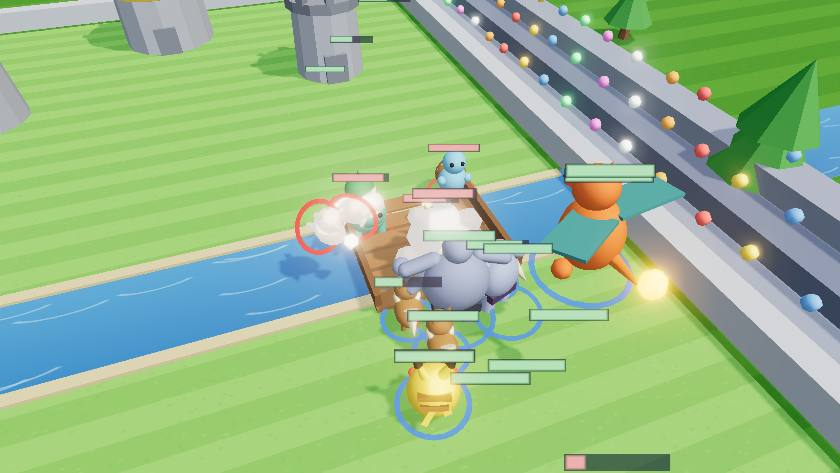

<h1 align="center">Poké Royale ⚡👑</h1>

<p align="center">
  <b>A 3D, physics-driven Clash Royale — built with AI by <a href="https://www.tiktok.com/@ty.prompts.ai">@ty.prompts.ai</a></b>
</p>

<p align="center">
  <a href="https://poke-royale-nu.vercel.app"></a>
  <a href="https://www.tiktok.com/@ty.prompts.ai"></a>
</p>

<p align="center">
  <a href="https://poke-royale-nu.vercel.app"></a>
</p>

<p align="center">
  
  
  
</p>

A **Clash Royale–style real-time strategy game** with Pokémon-inspired creatures, rendered as a fully **3D battlefield you can zoom into**, with real physics — built from scratch with Three.js and the Rapier physics engine. No game engine, no art assets: every creature, tower, and effect is generated procedurally in code.

> ### 🎬 Built live with AI by [@ty.prompts.ai](https://www.tiktok.com/@ty.prompts.ai)
> This entire game was built using AI coding agents — start to finish. **[Follow @ty.prompts.ai on TikTok](https://www.tiktok.com/@ty.prompts.ai)** for the build-alongs, the exact prompts, and what gets added next. ⚡
>
> **Fork it, clone it, learn from it, remix it** — it's free and open source. Want to extend it? See **[PROMPTS.md](PROMPTS.md)** for ready-to-paste prompts. Read the [Legal / Fan Project](#legal--fan-project) note before publishing your own build.

---

## ▶️ Quick start

```bash
git clone <your-fork-url> poke-royale
cd poke-royale
npm install
npm run dev        # → http://localhost:5173
```

That's it — no API keys, no backend, no environment variables. It runs fully in the browser.

| Command | What it does |
|---------|--------------|
| `npm run dev` | Dev server with hot reload |
| `npm run build` | Type-check + production bundle to `dist/` |
| `npm run preview` | Serve the production build locally |

Requires Node 18+.

## 🎮 How to play

- **Pick your opponent difficulty** (Rookie / Trainer / Champion) on the home screen.
- **Build a deck** of 8 cards from the 15 available, then hit Battle.
- **Drag a card** from your hand onto your half of the arena to deploy it.
- Destroy more towers than the AI in 3 minutes. Take the **King Tower** for an instant win. Final minute = **double elixir**. Tied at the horn → **sudden death**.

**Camera / controls:** mouse wheel or pinch to zoom into the battle · right-drag to orbit · left-drag to pan · `R` reset view · `M` mute. Trophies and King Level persist between matches (local only).

## 🃏 The deck (15 cards, 4 rarities)

Rarity hints at power — some creatures are simply stronger. Each has distinct stats, a unique attack visual, and a counter it answers.

| Card | Rarity | Cost | Role |
|------|--------|------|------|
| 💧 Squirtle | Common | 2 | Cheap ranged water plinker (hits air) |
| 🌿 Bulbasaur | Common | 3 | Sturdy ground seed-shooter |
| 🦊 Eevee Pack | Common | 2 | 3-unit melee swarm |
| 🦇 Zubat Trio | Common | 3 | Flying anti-air swarm |
| ⚡ Pikachu | Rare | 3 | Fast electric bolts, hits air |
| 🥊 Machoke | Rare | 3 | Glass-cannon brawler |
| ☄️ Fire Blast | Rare | 3 | Spell — splash + knockback |
| ❄️ Ice Beam | Rare | 4 | Spell — freezes a push 4s |
| 👊 Machamp | Epic | 5 | Four-armed wall, heavy punches |
| 👻 Gengar | Epic | 4 | Fast melee assassin |
| 😴 Snorlax | Epic | 4 | Lane-blocking building, taunts tanks |
| 🌩️ Thunder | Epic | 4 | Spell — nukes a tight cluster |
| 🔥 Charizard | Legendary | 5 | Flying fireballs, splash damage |
| 🪨 Golem | Legendary | 6 | Tower-smashing tank |
| 🐉 Dragonite | Legendary | 5 | Aerial tower-buster |

## 🛠 How it works

- **Rendering** — Three.js with PCF soft shadows, ACES tone mapping, and an UnrealBloom pipeline. Quality is adjustable in Settings (pixel ratio, shadows, bloom). Every creature is a procedural low-poly model built from primitives in [`src/models.ts`](src/models.ts).
- **Physics** — Rapier (WASM). Units are dynamic rigid bodies: they collide, shove, take knockback, and **ragdoll** on death. Towers shatter into physical rubble. The river blocks ground units except at the bridges; flyers soar over.
- **Simulation** — fixed 60 Hz step with an accumulator; rendering is uncapped.
- **AI** — a scored, archetype-aware opponent ([`src/ai.ts`](src/ai.ts)): it reads your strongest push, counter-picks the right answer (anti-air vs flyers, swarms vs tanks, splash vs swarms), exploits opened lanes, banks elixir, and holds spells for value. Three difficulty tiers.
- **Distinct attacks** — per-card projectile styles (electric bolt, water bubble, spinning leaf, fireball) in [`src/projectile.ts`](src/projectile.ts), and per-card melee styles (punch / slam / slash / bite) with unique animations and impact FX.
- **Audio** — every sound is synthesized live with WebAudio (oscillators + noise), including the music loop. Zero audio files.
- **Progression** — trophies, win/loss record, and a King Level that buffs your towers, persisted to `localStorage`.

## 📁 Project structure

```
src/
  main.ts            entry + screen flow (home → deck → match → end)
  game.ts            orchestrator: scene, physics, match loop, targeting
  ai.ts              the AI opponent (difficulty tiers, counter-picking)
  cards.ts           all 15 card definitions + deck logic
  unit.ts            creature behavior, combat, melee styles, ragdoll
  tower.ts           tower behavior + king activation
  projectile.ts      per-style ranged projectile visuals
  models.ts          procedural 3D creature + tower models
  arena.ts           environment, river, bridges, lighting
  effects.ts         particles, HP bars, spell FX
  audio.ts           synthesized SFX + music
  progression.ts     trophies / king level (localStorage)
  settings.ts        audio + graphics settings
  screens/           home + settings overlays
  deckBuilder.ts     pre-match 8-of-15 deck picker
  ui.ts              in-match HUD
```

## 🤝 Contributing / forking

PRs and forks welcome. Easy first additions:

- **New cards** — add an entry to `CARDS` in [`src/cards.ts`](src/cards.ts) and a model builder in [`src/models.ts`](src/models.ts). Everything else (deck builder, AI, HUD) picks it up automatically.
- **New arenas / themes** — tweak [`src/arena.ts`](src/arena.ts).
- **New projectile/melee styles** — extend the `ProjectileStyle` / `MeleeStyle` unions in [`src/types.ts`](src/types.ts).

Roadmap ideas left on the table: card Evolutions, an activated-ability Champion hero, and online 1v1.

## 🤖 Improve it with AI

This whole game was built with AI coding agents — and you can keep extending it the same way. **[PROMPTS.md](PROMPTS.md)** is a library of **ready-to-paste prompts** for adding cards, game modes, power-ups, graphics upgrades, and more. Clone the repo, open it in [Claude Code](https://claude.com/claude-code) / Cursor / Windsurf, and paste one in.

🎬 **Follow [@ty.prompts.ai on TikTok](https://www.tiktok.com/@ty.prompts.ai)** for AI build-alongs and prompt drops — and tag the account if you ship something with these.

## ⚖️ Legal / Fan Project

This is a **non-commercial, unaffiliated fan tribute**. It ships **no official or extracted assets** — all 3D models are generated from code, and all sounds are synthesized. The MIT [LICENSE](LICENSE) covers the original source code **only**.

**Pokémon** and the names and likenesses of its creatures are trademarks of **Nintendo / Creatures Inc. / GAME FREAK inc.** This project is not endorsed by or associated with them. Trademark rights are **not** transferable by this license — forking the code does not grant you any rights to those names or characters.

> **If you plan to publish or promote your own build:** the safest path is to **de-brand** — swap the creature names, emoji, and color identities in `src/cards.ts` for original critters (the engine is 100% generic and doesn't depend on the Pokémon names). That turns this into a clean, freely shareable RTS template.

## License

[MIT](LICENSE) © 2026 Tytan.eth — code only; see the note above regarding third-party trademarks.

---

<p align="center">
  <b>Built with AI by <a href="https://www.tiktok.com/@ty.prompts.ai">@ty.prompts.ai</a> — follow on TikTok for more. ⚡👑</b><br>
  <a href="https://www.tiktok.com/@ty.prompts.ai">https://www.tiktok.com/@ty.prompts.ai</a>
</p>
